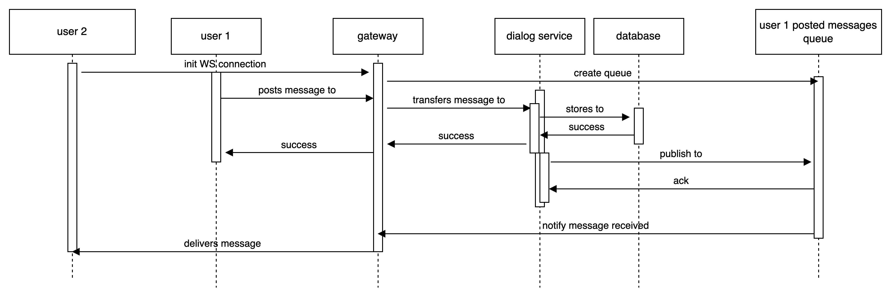

# Домашнее задание
## Масштабируемая подсистема диалогов

## Описание работы сервиса

Запросы REST API /dialog/{user_id}/list и /dialog/{user_id}/send идут на монолит. Он в данный момент выполняет роль API шлюза. На монолите выполняется авторизация пользователя и если она прошла успешно, запрос перенапрявляется на микросервис уже как POST запрос с user_id в качестве payload уже без токенов-идентификаторов сессий.
На следующих этапах разработки микросервис также не будет доступен из вне и будет закрыт шлюзом который будет выполнять авторизацию и балансировку запросов (еще не реализовано):



Диалоги и их сообщения в базе хранятся таким образом:

```sql
CREATE TABLE IF NOT EXISTS dialog_messages (
    id UUID DEFAULT uuid_generate_v4(),
    dialog_id UUID DEFAULT uuid_generate_v4(),
    user_id UUID DEFAULT uuid_generate_v4(),
    content TEXT,
    constraint pk_dialog_messages primary key (id, dialog_id)
);
```

```sql
CREATE TABLE IF NOT EXISTS dialogs (
    id UUID DEFAULT uuid_generate_v4(),
    user_id1 UUID,
    user_id2 UUID
);
```

Основная таблица где хранятся сообщения пользователей это "dialog_messages". Таблица "dialog_messages" связана по "dialog_id" с таблицей "dialogs", которая хранит информацию о том, что сообщение с конкретным dialog_id будет относится к диалогу между двумя даммыми пользователями.

Привязка сообщений к определенному "dialog_id" сделана для правильного распределения сообщений по шардам. Так как шардирование таблицы dialog_messages мы будем производить по ключу "dialog_id" (`SELECT create_distributed_table('dialog_messages','dialog_id');`), то в результате мы автоматически должны получить такое распределение сообщений пользователей по шардам базы, что все сообщения, относящиеся к определенному диалогу у нас будут находится на одном шарде. И при выборке сообщений определенного диалога из таким образом шардированной базы серверу нужно будет выбрать данные только из одного шарда.


В коде самого микросервиса в файле dialogs/src/dialog.rs запрос пришлось разделить на 2 части:
```rust
    pub async fn list_messages<C: GenericClient>(
        pg_client: &C,
        user_id1: Uuid,
        user_id2: Uuid,
        offset: usize,
        limit: usize,
    ) -> Result<Vec<Message>, tokio_postgres::Error> {
        let stmt = pg_client.prepare(
            "SELECT id FROM dialogs WHERE (user_id1 = $1 AND user_id2 = $2) OR (user_id1 = $2 AND user_id2 = $1)"
        ).await?;

        let row = pg_client.query_one(&stmt, &[&user_id1, &user_id2]).await?;
        if row.is_empty() {
            return Ok(Vec::new());
        }

        let dialog_id: uuid::Uuid = row.get(0);

        let stmt = pg_client.prepare(
            "SELECT id, dialog_id, user_id, content FROM dialog_messages WHERE dialog_id = $1 ORDER BY id OFFSET $2 LIMIT $3"
        ).await?;

        let rows = pg_client.query(&stmt, &[&dialog_id, &(offset as i64), &(limit as i64)]).await?;

        let mut messages = Vec::new();
        for row in rows {
            messages.push(Message {
                id: row.get(0),
                dialog_id: row.get(1),
                user_id: row.get(2),
                content: row.get(3),
            });
        }

        Ok(messages)
    }
}
```

Сначала выбираем ID диалога, а затем выбираем сообщения относящиеся к этому диалогу. Так пришлось сделать потому и при вложенном запросе и при join запросе сервер похоже не мог определить что подзапрос получает только один Dialog ID и в результате просматривал все шарды для поиска сообщений.


## Запуск

Запускаем 'dialogs' микросервис:
```bash
POSTGRES_PASSWORD=postgres docker compose -f dialogs/docker-compose.yaml -p dialogs up --scale worker=2 -d
```

Для запуска кластера на базе Citus я использовал конфигурацию описанную здесь:
https://github.com/citusdata/docker/tree/master

Для проверки работоспособности Citus конфигурации я захожу в базу основного приложения (монолита) и выбираю от туда 2 User ID . Используя эти User ID я создаю запись в таблице "dialogs" и получаю значение dialog_id . Используя этот dialog_id я создаю несколько сообщений для данного диалога как описано ниже. 

Подключаемся к master узлу микросервиса любым способом (я захожу через docker desktop > containers > dialogs_master > Exec) и загружаем тестовые данные сообщений:
```bash
psql
postgres=# INSERT INTO dialogs (user_id1, user_id2) VALUES ('886f4e05-36fc-426e-8f10-b7ac4d0d618e','d75e1fd9-c6a9-4822-a0ab-32fe99ef3220');
postgres=# INSERT INTO dialog_messages (dialog_id,user_id,content) SELECT 'a164bc0f-66d2-48e1-be96-ce5f6ca17a2a', '886f4e05-36fc-426e-8f10-b7ac4d0d618e', 'Neque porro quisquam est qui dolorem ipsum quia dolor sit amet' FROM generate_series(1,1000);
postgres=# INSERT INTO dialog_messages (dialog_id,user_id,content) SELECT 'a164bc0f-66d2-48e1-be96-ce5f6ca17a2a', 'd75e1fd9-c6a9-4822-a0ab-32fe99ef3220', 'Aenean dictum pretium commodo. Mauris pellentesque nisl eget diam varius molestie.' FROM generate_series(1,1000);
```

## Проверка работоспособности

Для проверки работы шардирования проведем такие тесты:
1. Посмотрим как сервер будет выполнять запрос без указания ключа шардирования в запросе.
```sql
EXPLAIN SELECT * FROM dialog_messages LIMIT 10;
```

Получаем результат:
```text
                                                    QUERY PLAN                                                    
------------------------------------------------------------------------------------------------------------------
 Limit  (cost=0.00..0.00 rows=10 width=80)
   ->  Custom Scan (Citus Adaptive)  (cost=0.00..0.00 rows=100000 width=80)
         Task Count: 32
         Tasks Shown: One of 32
         ->  Task
               Node: host=dialogs-worker-1 port=5432 dbname=postgres
               ->  Limit  (cost=0.00..0.23 rows=10 width=80)
                     ->  Seq Scan on dialog_messages_102008 dialog_messages  (cost=0.00..17.50 rows=750 width=80)
```

Видно, что сервер будет выбирать записи из всех шардов чтобы получить итоговый результат: `Task Count: 32`

2. Теперь добавим фильтр "dialog_id" в запрос:
```bash
postgres=# SELECT id FROM dialogs;
                  id                  
--------------------------------------
 a164bc0f-66d2-48e1-be96-ce5f6ca17a2a
(1 row)

postgres=# EXPLAIN SELECT * FROM dialog_messages WHERE dialog_id = 'a164bc0f-66d2-48e1-be96-ce5f6ca17a2a' LIMIT 10;
                                                  QUERY PLAN                                                  
--------------------------------------------------------------------------------------------------------------
 Custom Scan (Citus Adaptive)  (cost=0.00..0.00 rows=0 width=0)
   Task Count: 1
   Tasks Shown: All
   ->  Task
         Node: host=dialogs-worker-1 port=5432 dbname=postgres
         ->  Limit  (cost=0.00..0.32 rows=10 width=121)
               ->  Seq Scan on dialog_messages_102036 dialog_messages  (cost=0.00..63.00 rows=2000 width=121)
                     Filter: (dialog_id = 'a164bc0f-66d2-48e1-be96-ce5f6ca17a2a'::uuid)
```

Видим, что сервер выполняет выборку данных только из одного шарда: `Task Count: 1`


## Масштабирование

Попробуем увеличить количество воркеров в качестве горизондального масштабирования. Для этого выполним:


```bash
POSTGRES_PASSWORD=postgres docker compose -f dialogs/docker-compose.yaml -p dialogs up --scale worker=5 -d
```

Видим что узлы поднялись:
```sql
SELECT master_get_active_worker_nodes();
```

Смена типа wal_level на logical:
```sql
ALTER SYSTEM SET wal_level = logical; SELECT run_command_on_workers('ALTER SYSTEM SET wal_level = logical');
SELECT pg_reload_conf();SELECT run_command_on_workers('SELECT pg_reload_conf()');
```

Запустим перебалансировку:
```sql
SELECT citus_rebalance_start();
```

Проверим результат:
```sql
SELECT * FROM citus_rebalance_status();
SELECT nodename, count(*) FROM citus_shards GROUP BY nodename;
```


SELECT shard_count FROM citus_tables WHERE table_name::text = 'dialog_messages';